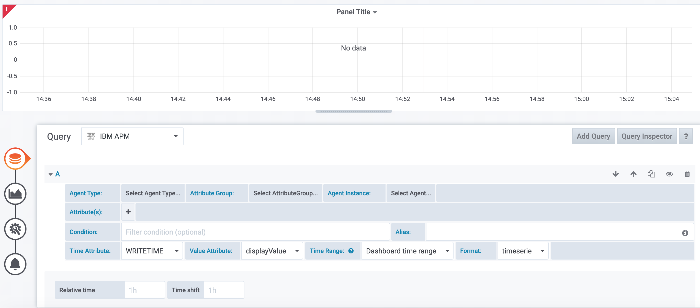
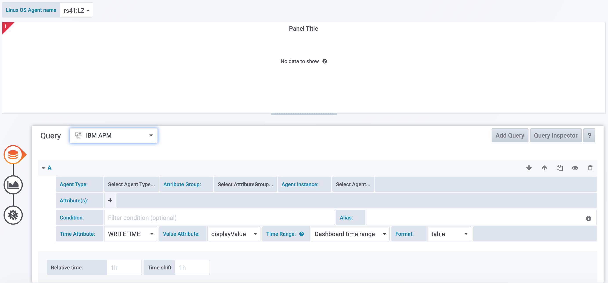
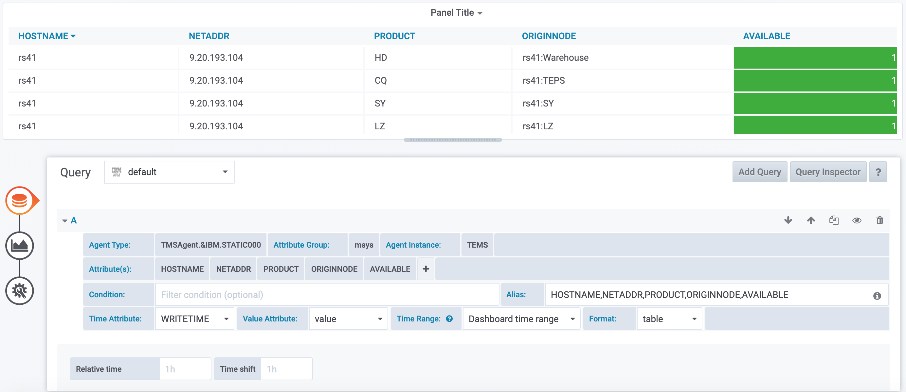
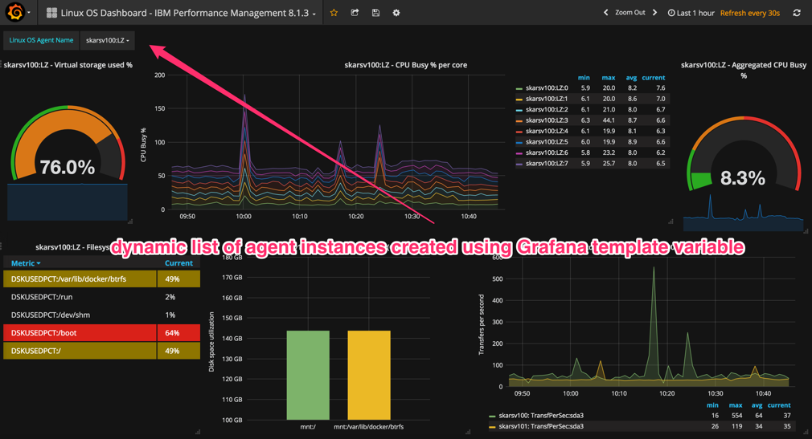
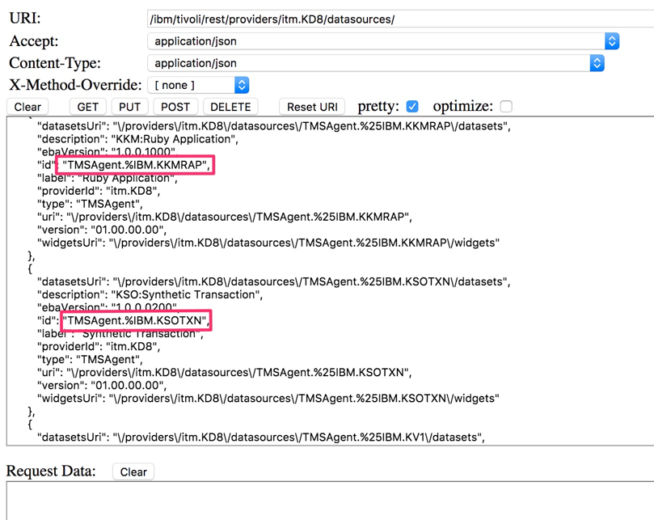

# IBM APM plugin for Grafana

[Changelog](changelog.md)

> Version 0.9 includes a couple of new features (see [Changelog](changelog.md)) and dashboards created with older version of the IBM APM Grafana plugin may be not fully compatible. You may need to fix or recreate some of the table and snglestat panels.  

> You may be also interested in [Prometheus exporter for ITM](https://github.com/rafal-szypulka/itm_exporter).

- [Introduction](#Introduction)
- [Configure the ITM/APM data source](#Configure-the-ITMAPM-data-source)
- [Query Editor](#Query-Editor)
  - [Example 1: Line chart for Linux OS CPU](#Example-1-Line-chart-for-Linux-OS-CPU)
  - [Example 2: Table with Agents status](#Example-2-Table-with-Agents-status)
- [Templating](#Templating)
- [Example dashboards](#Example-dashboards)
- [Troubleshooting](#Troubleshooting)

# Introduction

IBM APM plugin provides Grafana support for:

- IBM Tivoli Monitoring 6.x and IBM OMEGAMON
- IBM SmartCloud Application Performance Management 7.x 
- IBM Cloud Application Performance Management Private

The plugin collects data directly from APM v8 or ITM v6 metrics REST API.

# Configure the ITM/APM data source

The screen below illustrates the configuration for the ITM v6 data source:

Specify the REST API URL:

-   APMv8

`http://<apm_server_hostname>:8090/ibm/tivoli/rest/providers/itm.KD8`

-   ITMv6/SCAPMv7

`http://<TEPS_server_hostname>:15200/ibm/tivoli/rest/providers/itm.<TEMS_NAME>`

**Note:** If you connect IBM APM data source to Hub TEMS with HA configuration or `<TEMS_NAME>` contains non-alphanumeric characters, then define Domain Override in TEPS Data Provider. Check [issue #3](https://github.com/rafal-szypulka/grafana-ibm-apm/issues/3) for more details. 

Select **Basic Auth** and specify the user name

- APMv8 – `smadmin`
- ITMv6/SCAPMv7 - `sysadmin` 

Select checkbox `Deallocate dataset after every metric query`. It is recommended to have it enabled all the time. Lack of datasource deallocation requests may cause memory leak and OutOfMemory exceptions on APM or ITM server. Disable this option only for testing a new panel query, if you want to use Grafana Query Inspector feature.

# Query Editor

The query editor for IBM APM Grafana plugin helps to assemble ITM/APM metrics API request.

The examples below show how to use it.

## Example 1: Line chart for Linux OS CPU

1).  Add new panel, select `Graph` as a visualization type, select `Queries` and your configured IBM APM data source.
   

2).  Select `Agent Type`. You can type agent code or agent type name to search for supported agent type or scroll down a dropdown list.
The list is built dynamically through the REST API call. If the resulting dropdown list is empty, a possible cause might be a connection problem with the APM REST API. You can troubleshoot it with Developer Tools in Chrome or Firebug in Firefox (see the Troubleshooting chapter at the end of this document).

3).  Similar way select other parameters like `Attribute Group`, `Group by` (only for Attribute groups with Primary Key/Display Item) and `Agent Instance`. Make sure that selected `Format` for Graph panel is `timeserie`.

4).  Click `+` to select one or more `Attributes` (metrics).

5).  Optionaly specify a `Condition` (for filtering results) and edit default `Aliases` for parameter name
customization. Alias, if defined, will replace the default parameter name in the legend. The default is *AttributeName:DisplayItem*. The alias replaces *AttributeName* part.

6).  The result should be similar to the one below:
   

## Example 2: Table with Agents status
1).  Add new panel, select `Table` as a visualization type, select Queries and your configured IBM APM data source.
   
   

2).  Select parameters in the first row of Query Editor like `Agent Type`, `Attribute Group`. In our example we will show current agent status, so select `ANY:All Managed Systems` Agent Type, `Managed System Information` Attribute Group, and `TEMS` Agent Instance. Make sure that selected `Format` for Table panel is `table`.

3).  Select the following `Attributes` in the second row of Query Editor: HOSTNAME, NETADDR, PRODUCT, ORIGINNODE, AVAILABLE.

4).  The result should be similar to the one below:
   

# Templating

The IBM APM plugin for Grafana supports the basic templating feature.

The agent instances list (dynamic and searchable) in the upper left corner was created using Grafana template variable. When you select another agent instance, all the panels are updated with data from another agent instance.

**How to set it up step by step:**

1.  Create the template variable. Click
     **Manage dashboards** > **Templating**, then click the **+New**

2.  Specify the template settings as shown in the picture below:

Variable name **AgentName** will be used in a panel query as **$AgentName** and will
be substituted during query execution by the current option selected
from the upper-left corner list. Select your APM Data Source and specify
agent type in the Query.

Agent Type in the Query field should be specified in an obscure form of the
APM REST API datasource id (it may be improved in a future
version of the plugin). For example, for Linux OS Agent it is **TMSAgent.%IBM.STATIC134**.

Datasource IDs can be listed using APM REST API test tool via HTTP GET
request of the following URL:

/ibm/tivoli/rest/providers/itm.KD8/datasources for APMv8 or
/ibm/tivoli/rest/providers/itm.&lt;TEMS\_name&gt;/datasources for
ITMv6/SCAPMv7.

# [Example dashboards](example_dashboards.md)

# [Troubleshooting](troubleshooting.md)