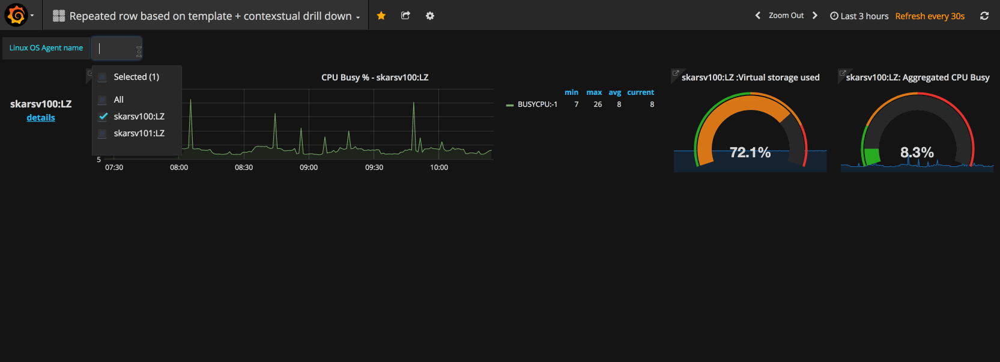
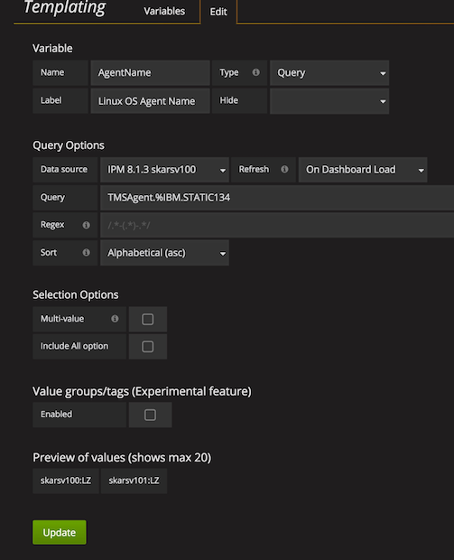

# IBM APM plugin for Grafana

Author: Rafal Szypulka 

Contact: rafal.szypulka@pl.ibm.com

Revision: 0.3

**What's new:**

- 0.3 - New field **Time Range** in the panel query editor. If set to *Current value*, then panel query will ignore global dashboard time filter and show only the current value of the metric. Use it only for singlestat and table panels. 

Contents 
========

[**1. Introduction**](#introduction)

[**2. Download**](#download)

[**3. Demo environment**](#demo-environment)

[**4. Example dashboards**](#example-dashboards)

[**5. How to create a new panel using the IBM APM datasource**](#how-to-create-a-new-panel-using-the-ibm-apm-datasource)

[**6. Grafana installation**](#grafana-installation)

[**7. IBM APM plugin installation**](#ibm-apm-plugin-installation)

[**8. IBM APM data source configuration**](#ibm-apm-data-source-configuration)

[**9. Templating**](#templating)

[**10. Troubleshooting**](#troubleshooting)

Introduction
============

Grafana is an open source metric analytics and visualization suite. It is most commonly used for visualizing time series data for infrastructure and application analytics, but many use it in other domains including industrial sensors, home automation, weather, and process control.

Features: [*https://grafana.com/grafana*](https://grafana.com/grafana)

Basic Concepts
[*http://docs.grafana.org/guides/basic\_concepts/*](http://docs.grafana.org/guides/basic_concepts/)

Live Demo: [*http://play.grafana.org/*](http://play.grafana.org/)

Documentation: [*http://docs.grafana.org/*](http://docs.grafana.org/)

Plugins: *<https://grafana.com/plugins>* (or search for Grafana on GitHub)

IBM APM plugin adds Grafana support for APMv8 (on premises version only) and ITMv6/SCAPMv7. The plugin uses metrics REST API to collect data directly from APMv8 and ITMv6
and show on the Grafana dashboard.


Download
========

The code is provided as-is and it is not supported by IBM.

[grafana-ibm-apm-v0.3.tar.gz](./grafana-ibm-apm-v0.3.tar.gz)

Installation instructions are in [chapter 7](#ibm-apm-plugin-installation).

Demo environment
===================

The live demo environment is available here: [ibm.biz/grafana-ibm-apm](http://ibm.biz/grafana-ibm-apm). User: demo. Password: demo.
Alternative URL with SSL: [ibm.biz/grafana-ibm-apm-ssl](http://ibm.biz/grafana-ibm-apm-ssl)

The live demo user has the role of **Read Only Editor** in the Grafana main organization. You can see how dashboards are configured and make
temporary changes, but you can’t save them.
If you want to create and save your dashboard, please switch to **sandbox** organization, by clicking the Grafana logo -&gt; DEMO user -&gt;
Switch to sandbox.

If you want to customize existing dashboard in the sandbox environment, copy it first by clicking  Manage Dashboard > Save as, enter a new name and then make your changes.


Example dashboards
==================

1). Sample IBM Stack monitoring dashboard with data from Linux OS, IBM HTTP Server, WebSphere Applications, WebSphere MQ, IBM DB2 and IBM Integration Bus agents:
    [*http://169.44.6.110/dashboard/db/sample-ibm-stack-monitoring?refresh=30s&orgId=1*](http://169.44.6.110/dashboard/db/sample-ibm-stack-monitoring?refresh=30s&orgId=1)
    
    


2). Linux OS dashboard with the list of agents based on Grafana template variable. Data collected from APMv8.
[*http://169.44.6.110/dashboard/db/linux-os-dashboard-ibm-performance-management-8-1-3?refresh=30s&orgId=1*](http://169.44.6.110/dashboard/db/linux-os-dashboard-ibm-performance-management-8-1-3?refresh=30s&orgId=1)


3). Linux OS dashboard with the list of agents based on Grafana template variable. Data collected from ITM 6.

[*http://169.44.6.110/dashboard/db/linux-os-dashboard-ibm-tivoli-monitoring-6-3-0-7?refresh=30s&orgId=1*](http://169.44.6.110/dashboard/db/linux-os-dashboard-ibm-tivoli-monitoring-6-3-0-7?refresh=30s&orgId=1)

It looks exatly the same as the one above, but data is collected from ITMv6.

4). Mashup of ITMv6 and APMv8 data on the same chart.

[*http://http://169.44.6.110/dashboard/db/mashup-itm63-apm813?refresh=30s&orgId=1*](http://169.44.6.110/dashboard/db/mashup-itm63-apm813?refresh=30s&orgId=1)


5). Repeated row example with contextual drill down to more detailed dashboard.

[*http://169.44.6.110/dashboard/db/repeated-row-based-on-template-contextual-drill-down?refresh=30s&orgId=1*](http://169.44.6.110/dashboard/db/repeated-row-based-on-template-contextual-drill-down?refresh=30s&orgId=1)



6). Sample IBM IIB monitoring dashboard.

[*http://169.44.6.110/dashboard/db/sample-iib-dashbaord?refresh=30s&orgId=1*](http://169.44.6.110/dashboard/db/sample-iib-dashbaord?refresh=30s&orgId=1)


7). Transaction Volume and Response Time collected by the Web Response Time Agent.

[*http://169.44.6.110/dashboard/db/transactions-collected-by-response-time-agent?refresh=30s&orgId=1*](http://169.44.6.110/dashboard/db/transactions-collected-by-response-time-agent?refresh=30s&orgId=1)


8). Simulated Transaction Volume collected the the custom agent created with the Agent Builder.

[*http://169.44.6.110/dashboard/db/simulated-transactions-volumes-monitored-by-custom-apm-agent-1?orgId=1*](http://169.44.6.110/dashboard/db/simulated-transactions-volumes-monitored-by-custom-apm-agent-1?orgId=1)


How to create a new panel using the IBM APM datasource
===============================

Follow these steps to create a sample chart showing
disk IO metric for specific disk collected from two different servers.


1.  Grafana logo -&gt; Dashboards -&gt; New.
2.  Drag and drop the Graph icon to the Empty Space.

3.  Now it should look like below.

4.  Click on the **Panel Title** bar and select **Edit**.

5.  Click the **Panel data source** list and select the APM data source. In this example it is named *APMv8.1.3 skarsv100*.

6.  Select **Agent Type** (you can type agent code or agent type name to
    search for supported agent type or scroll down a dropdown list).
    The list is built dynamically through the REST API call. If the resulting list is empty, a possible cause might be a connection problem with the APM REST API. You can easily debug it with developer tools in Chrome or Firebug in Firefox (see the
    Troubleshooting chapter at the end of this document).

7.  Select other parameters like Attribute Group, Attribute, Group by
    (only for Attribute groups with Primary Key/Display Item) and Agent
    Instance.
8.  Condition (for filtering results) and Alias (for parameter name
    customization) are optional. Alias, if defined will replace the default
    parameter name in the legend. The default is *AttributeName:DisplayItem*.
    The alias replaces *AttributeName*.
9.  The result should be similar to the one below.

10.  In this example we want to draw data from two different agents on the
    same line chart. Click **+Add query**, to add a query from another agent
    and select the attribute the same way as above. The result should be similar
    to the one below.

11.  Now let’s add the example filtering statement, and add agent name to the
    legend in the **Alias field**, so we can easily distinguish which line
    belongs to a particular agent. Add the **Condition** and **Alias** as shown in the example below.

12.  We are almost done! Add a proper chart title in General tab.

13.  Customize the legend in the Legend tab to make it look better and
    provide more useful information. Much more can be customized in the
    Display tab.
If you want to customize each data series separately, use the Display tab
and Series overrides section.

14.  The chart is completed. You can resize it if you want to include more
    panels in the row, add new rows with the new panels and so on.


Grafana installation
====================

Follow the steps described in the Grafana documentation:
[*http://docs.grafana.org/installation/*](http://docs.grafana.org/installation/)

If you plan to access the REST API of the latest version of APMv8 (8.1.3 if009 at the time of writing this document), you will need to use one of the following workarounds:

- Disable the Referer HTTP header in the browser settings. Firefox: in the about:config page, search for Network.http.sendRefererHeader and set it to 0. Chrome requires a custom extension like [Referer Control](https://chrome.google.com/webstore/detail/referer-control/hnkcfpcejkafcihlgbojoidoihckciin).

- Install Nginx and access the Grafana URL through Nginx acting as a reverse proxy.
Nginx should be configured to clear the Referer header. In the nginx.conf modify location section and set it (if Nginx is installed locally on Grafana server) to:

```
        location / {
             proxy_pass http://localhost:3000/;
             proxy_set_header Referer "";
        } 
```

Full installation and configuration process (Grafana, Nginx and IBM APM plugin) is also recorded [here](https://developer.ibm.com/apm/videos/grafana-plugin-ibm-apm-installation-import-sample-dashboards/).

IBM APM plugin installation
===========================

1).  Download [grafana-ibm-apm-v0.3.tar.gz](./grafana-ibm-apm-v0.3.tar.gz)
and unpack it in Grafana plugin directory.

For Grafana installed using yum/rpm, it is: `/var/lib/grafana/plugins`.
To verify, check the following path after plugin unpack:
`
/var/lib/grafana/plugins/grafana-ibm-apm/dist/datasource.js
`

Other method (if Grafana has an internet access) is to clone GitHub repository using:

```
cd /var/lib/grafana/plugins/
git clone https://github.com/rafal-szypulka/grafana-ibm-apm
```

2).  Restart Grafana. On RedHat/Centos run:

`systemctl restart grafana-server`

IBM APM data source configuration
=================================

Click the Grafana Logo -&gt; Data Sources and click **+Add data source**.


Specify the data source name and select “IBM APM” from the list.


Specify the REST API URL:

-   APMv8

http://&lt;apm\_server\_hostname&gt;:8090/ibm/tivoli/rest/providers/itm.KD8

-   ITMv6/SCAPMv7

http://&lt;teps\_server\_hostname&gt;:15200/ibm/tivoli/rest/providers/itm.&lt;TEMS\_NAME&gt;

Select **Basic Auth** and **With credentials** and specify the user name

-   APMv8 – smadmin (default password apmpass)

-   ITMv6/SCAPMv7 sysadmin (password for ITM sysadmin user)


The Screen below illustrates the completed configuration for the APMv8 data source:

{

Click **Save & Test**. If the connection is successful, you should see the following
message:


Configuration for ITMv6/SCAPMv7:


Click Cancel to exit. Now both data sources are configured.


Templating
==========

The IBM APM plugin for Grafana supports the basic templating feature. Check the example dashboard:

[*http://169.44.6.110/dashboard/db/linux-os-dashboard-ibm-performance-management-8-1-3?refresh=30s&orgId=1*](http://169.44.6.110/dashboard/db/linux-os-dashboard-ibm-performance-management-8-1-3?refresh=30s&orgId=1)


The agent instances list (dynamic and searchable!) in the upper left corner
was created using Grafana template variable. When you select another
agent instance, all the panels are updated with data from another agent
instance.

**How to set it up step by step:**

1.  Create the template variable. Click
     **Manage dashboards** > **Templating**, then click the **+New**

2.  Specify the template settings as shown in the picture below:

Variable name **AgentName** will be used in a panel query as **$AgentName** and will
be substituted during query execution by the current option selected
from the upper-left corner list. Select your APM Data Source and specify
agent type in the Query.



Agent Type in the Query field should be specified in an obscure form of the
APM REST API datasource id (it may be improved in a future
version of the plugin). For example, for Linux OS Agent it is **TMSAgent.%IBM.STATIC134**.

Datasource IDs can be listed using APM REST API test tool via HTTP GET
request of the following URL:

/ibm/tivoli/rest/providers/itm.KD8/datasources for APMv8 or
/ibm/tivoli/rest/providers/itm.&lt;TEMS\_name&gt;/datasources for
ITMv6/SCAPMv7.


Troubleshooting
===============

1). IBM APM plugin for Grafana does not currently support Grafana Alerting feature.

2). If you configured your new panel and do not see the data, use the 
Chrome developer tools or Firefox Firebug and check the console – you should
see an error message there. For example, if there is a syntax error in the **condition** field, the REST API will return status code 500 and the error message will be logged in the javascript console.


3). The ITM REST API does not provide data
for **every** attribute. The plugin tries to filter out Attribute Groups not
available in the APM prefetch database, but even if the specific attribute group
is collected in prefetch, it could be that specific attribute is not
provided by the REST API. Use the Chrome developer tools (network tab) or
Firefox Firebug to see what requests are made to the REST API, copy it
and test in the APM REST API test tool:

APMv8: http://\<apm\_server\_hostname\>:8090/ITMRESTProvider/test.html

ITM6/SACAPM7: http://\<TEPS\_server\_hostname\>:15200/ITMRESTPrivider/test.html


Example request:


Example response:


The same request in the APM REST API test tool:


Note the difference in the request URL done from your browser to Grafana:

**169.44.6.110/api/datasources/proxy/2**/datasources/TMSAgent.%25IBM.STATIC134/datasets/MetricGroup.KLZCPU/items?clearCache=true&condition=CPUID+%3D+-1&optimize=true&param\_NoCache=false&param\_SourceToken=skarsv100:LZ&param\_Time=20170428T072122--20170428T082122&properties=BUSYCPU,WRITETIME,CPUID

Grafana proxies API requests, so the actual APM REST API call is done not from
your browser client, but from the Grafana server to the APM server.

To test the same request in the APM REST API test tool change it to:

**/ibm/tivoli/rest/providers/itm.KD8**/datasources/TMSAgent.%25IBM.STATIC134/datasets/MetricGroup.KLZCPU/items?clearCache=true&condition=CPUID+%3D+-1&optimize=true&param\_NoCache=false&param\_SourceToken=skarsv100:LZ&param\_Time=20170428T072122--20170428T082122&properties=BUSYCPU,WRITETIME,CPUID

4). If the REST API rejects requests from Grafana because of wrong HTTP referer header, use one of the proposed workarounds described in the installation chapter.

5). [ITMv6] If the historical collection is not enabled for attribute group specified in the panel query then, by default the similar error will be logged in the bowser console:

```
{"message":"IPM Error: undefined","data" {"msgId":"ATKRST100E","stackTrace":
"com.ibm.usmi.console.navigator.model.NavException: 
(ATKRST100E) ATKRST100E An unexpected error occured. 
The error message is as follows: 'KFWITM217E Request error: SQL1_OpenRequest failed 
rc=3000\n'.: nested exception is: 
\n\tcom.ibm.tivoli.monitoring.provider.navmodel.ITMRuntimeException:
 KFWITM217E Request error: SQL1_OpenRequest failed rc=3000\n\r\n\tat
 (...)
```
Enable historical collection for the following Attribute Groups, 
if you are going to import [sample dashboard for ITMv6 Linux OS Agents](https://github.com/rafal-szypulka/grafana-ibm-apm/blob/master/Example_dashboards/Linux%20OS%20Dashboard%20-%20IBM%20Tivoli%20Monitoring%206.3.0.7-1493380888346.json):

- KLZ CPU
- KLZ Disk
- KLZ Disk IO
- KLZ Network
- KLZ System Statistics
- KLZ VM Stats

Attributes from attribute groups not enabled for historical collection can be displayed in singlestat and table panels if the option **Time Range** is set to *Current value* in the panel query editor.