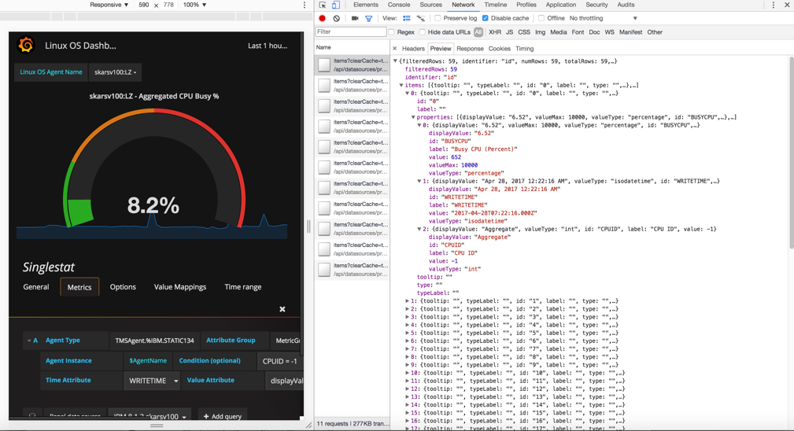

## Troubleshooting

1). IBM APM plugin for Grafana does not  support Grafana Alerting feature.

2). Some versions of APMv8 and ITMv6 do a HTTP Referer header check and reject REST API calls when Referer URL (host and port part) is different than APM or TEPS URL. Use one of the following workarounds to modify Referer header of requests coming from Grafana to APMv8 or TEPS.
- Disable the Referer HTTP header in the browser settings. Firefox: in the about:config page, search for Network.http.sendRefererHeader and set it to 0. Chrome requires a custom extension like [Referer Control](https://chrome.google.com/webstore/detail/referer-control/hnkcfpcejkafcihlgbojoidoihckciin).

- Install Nginx and access the Grafana URL through Nginx acting as a reverse proxy.
Nginx should be configured either to clear the Referer header or set it as APM/ITM URL with port http://xxx.xxx.xxx.xxx:xxx. In the nginx.conf modify location section and set it (if Nginx is installed locally on Grafana server) to:

```
        location / {
             proxy_pass http://localhost:3000/;
             proxy_set_header Referer "";
        } 
```

Full installation and configuration process (Grafana, Nginx and IBM APM plugin) is also recorded [here](https://developer.ibm.com/apm/videos/grafana-plugin-ibm-apm-installation-import-sample-dashboards/).

3). If you configured your new panel and do not see the data, use the 
Chrome developer tools or Firefox Firebug and check the console – you should see an error message there. For example, if there is a syntax error in the **condition** field, the REST API will return status code 500 and the error message will be logged in the javascript console.


4). The ITM REST API does not provide data
for **every** attribute. The plugin tries to filter out Attribute Groups not available in the APM prefetch database, but even if the specific attribute group
is collected in prefetch, it could be that specific attribute is not provided by the REST API. Use the Chrome developer tools (network tab) or Firefox Firebug to see what requests are made to the REST API, copy it
and test in the APM REST API test tool:

APMv8: http://\<apm\_server\_hostname\>:8090/ITMRESTProvider/test.html

ITM6/SACAPM7: http://\<TEPS\_server\_hostname\>:15200/ITMRESTPrivider/test.html


Example request:


Example response:



The same request in the APM REST API test tool:


Note the difference in the request URL done from your browser to Grafana:

**/api/datasources/proxy/2**/datasources/TMSAgent.%25IBM.STATIC134/datasets/MetricGroup.KLZCPU/items?clearCache=true&condition=CPUID+%3D+-1&optimize=true&param\_NoCache=false&param\_SourceToken=skarsv100:LZ&param\_Time=20170428T072122--20170428T082122&properties=BUSYCPU,WRITETIME,CPUID

Grafana proxies API requests, so the actual APM REST API call is done not from
your browser client, but from the Grafana server to the APM server.

To test the same request in the APM REST API test tool change it to:

**/ibm/tivoli/rest/providers/itm.KD8**/datasources/TMSAgent.%25IBM.STATIC134/datasets/MetricGroup.KLZCPU/items?clearCache=true&condition=CPUID+%3D+-1&optimize=true&param\_NoCache=false&param\_SourceToken=skarsv100:LZ&param\_Time=20170428T072122--20170428T082122&properties=BUSYCPU,WRITETIME,CPUID

5). If the REST API rejects requests from Grafana because of wrong HTTP referer header, use one of the proposed workarounds described in the installation chapter.

6). [ITMv6] If the historical collection is not enabled for attribute group specified in the panel query then, by default the similar error will be logged in the bowser console:

```
{"message":"IPM Error: undefined","data" {"msgId":"ATKRST100E","stackTrace":
"com.ibm.usmi.console.navigator.model.NavException: 
(ATKRST100E) ATKRST100E An unexpected error occured. 
The error message is as follows: 'KFWITM217E Request error: SQL1_OpenRequest failed 
rc=3000\n'.: nested exception is: 
\n\tcom.ibm.tivoli.monitoring.provider.navmodel.ITMRuntimeException:
 KFWITM217E Request error: SQL1_OpenRequest failed rc=3000\n\r\n\tat
 (...)
```
Enable historical collection for the following Attribute Groups, 
if you are going to import [sample dashboard for ITMv6 Linux OS Agents](https://github.com/rafal-szypulka/grafana-ibm-apm/blob/master/Example_dashboards/Linux%20OS%20Dashboard%20-%20IBM%20Tivoli%20Monitoring%206.3.0.7-1493380888346.json):

- KLZ CPU
- KLZ Disk
- KLZ Disk IO
- KLZ Network
- KLZ System Statistics
- KLZ VM Stats

Attributes from attribute groups not enabled for historical collection can be displayed in singlestat and table panels if the option **Time Range** is set to *Current value* in the panel query editor.